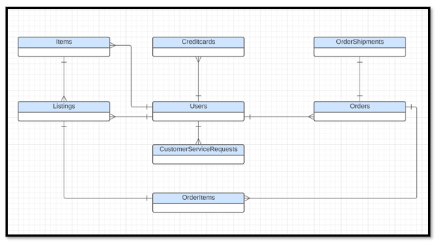
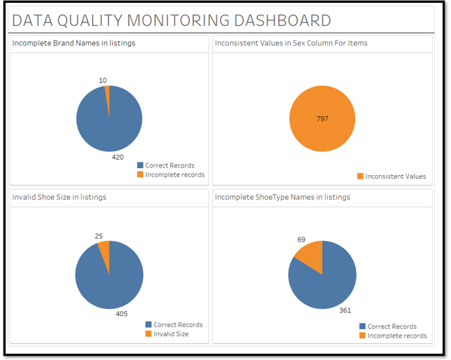
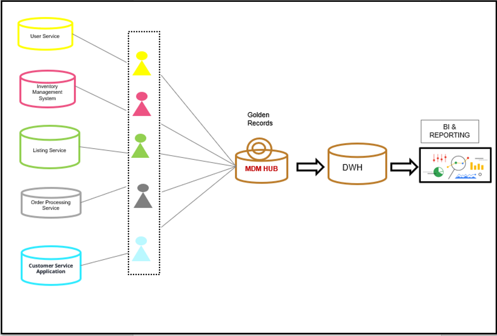

# Data Architect Nano Degree- Project 3: Data Governance at SneakerPark

## 1. Business Context:

SneakerPark is an online shoe reseller that allows people to buy and sell used and new shoes. Buyers can bid for shoes or buy them outright, and sellers can set a price or sell to the highest bidder.

Each buyer and seller must have an active account in order to sell, bid, or purchase sneakers using SneakerPark’s website.

SneakerPark authenticates the shoes before shipping them to the buyer, so before listing an item, the seller must ship it to SneakerPark’s warehouse. Upon receipt, SneakerPark assigns an item number to each pair of sneakers and notifies the seller that they are now free to list their item. If the item is not listed within 45 days, SneakerPark returns the sneakers to the seller and sends an invoice to the seller for the shipping cost.

If the item is found to be inauthentic or in an unacceptable condition, it is also returned back to the seller in a similar fashion.

When the item sells, the seller's account is credited with the purchase price minus the SneakerPark service fee and shipping fees to deliver the item to the buyer.

Currently, SneakerPark only supports sales within the United States.

## 2. Objective:

SneakerPark’s business has grown rapidly over the past year and it has led to some growing pains. As the number of sellers, buyers, items, and sales increased, the company started running into discrepancies between systems which resulted in mischarges, lost revenue, and frustrated customers. With this in mind, Sneaker Park has decided to invest in an Enterprise Data Management program to gain better visibility and control over their data systems.

Phase 1 of this initiative focuses on creating the foundational data management tools and artifacts that will allow SneakerPark to better manage its data now and in the future. More specifically, this entails documenting SneakerPark's data systems, setting up a data catalog, designing better data quality and master data management processes, and formalizing data governance roles.

As a newly hired Data Architect, you are asked to technically lead the Enterprise Data Management Program and get started with the implementation of Phase 1.

The company plans to expand on this foundation in Phase 2 and build out an Enterprise Data Warehouse solution to replace the existing legacy data warehouse, MS Access databases, and excel reports. Phase 2 is a separate initiative and therefore is not a part of this project.

## 4. Steps:

1. Create an Enterprise Conceptual Model that provides a holistic view of data in these three systems.

 

2. Design the draft version of the Enterprise Data Catalog by documenting the metadata in an [Excel spreadsheet](https://github.com/jahid-razan/Data-Architecutre-Nanodegree/blob/main/Data%20Governance/Business%20metadata.xlsx).

3. Profile the data to identify data quality issues. Create a [document](https://github.com/jahid-razan/Data-Architecutre-Nanodegree/blob/main/Data%20Governance/Business%20metadata.xlsx) that lists each data quality issue, its description, and a suggested remediation strategy for each.

4. Design a data quality dashboard that will report on the issues you’ve identified above plus at least 1 more issue that you foresee might occur in the future.

5. Based on SneakerPark’s systems and business model, sketch out a proposed MDM implementation architecture, and write a detailed explanation of why you chose this specific approach.

6. Define a set of matching rules that will be used by SneakerPark's MDM Hub to match item and customer entities between the company's different systems.

7. Discussing what data governance roles and responsibilities will be necessary to oversee this new Data Management initiative.

