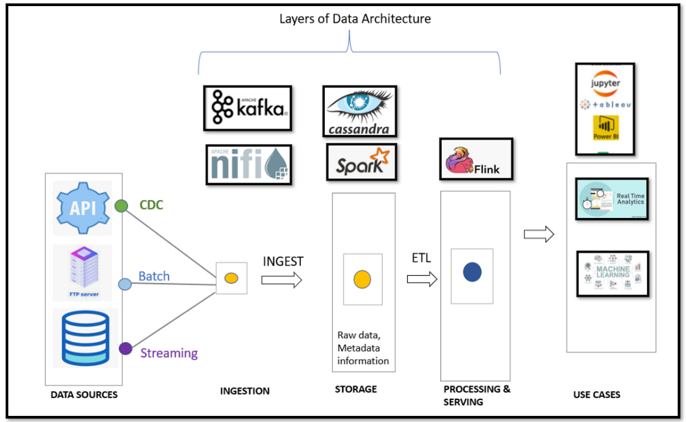

# Data Architect Nano Degree- Project 3: Architect Enterprise Data Lake for Medical Data Processing Company

## 1. Business Context:

Medical Data Processing Company of San Francisco is a company that specializes in processing various types of EMR (Electronic Medical Records) and providing real-time insights to medical facilities. The company has about 1,100 customers and is used by approximately 8,000 individual medical care facilities. Presently, the company hosts over 8TB of data in SQL Server.

The company has experienced rapid growth over the past three years. As the data volume continues to increase, the existing single-node SQL Server is unable to scale, resulting in slow ETL processes and SQL reporting queries due to the increased data volumes. The ad-hoc solutions require maintaining multiple versions of the same data, which is a waste of already scarce memory resources. Tracking the latest version has become a complex, error-prone process and has resulted in data silos within the company. The existing backup and recovery procedure is extremely fragile, with a single point of failure. In the event of a network failure, there is no way to avoid long downtime, resulting in risks and poor customer experience.

The CTO wants to build additional capabilities to solve this problem. He envisions a solution that can solve the problem of storage, downtime, and facilitate machine learning models for predictive analysis and near-real-time dashboards containing patient data for each facility without the need to move data from one system to another.

## 2. Objective:

The objective of this exercise is to design a data architecture that is scalable, fault-tolerant, and fast. In addition, to avoid potential vendor lock-in, the data architecture makes use of open-source tools with the above-mentioned characteristics as much as possible.

## 3. Deliverables:

There are four deliverables in this project:

* Data Lake Solution Architecture Diagram
* Data Lake Architecture Design Template
* A PowerPoint presentation targeted for CXO level audience showcasing Data Lake Value Proposition
* A ~8 minute video recording of your presentation, to the executive leadership of the company, of the Data Lake Value Proposition using the presentation from deliverable #3

## 4. Steps:

The document lists down the purpose, scope, and target audience for the project.

Based on the presented technical document, data architecture, objectives, it lists down the missing information and states required assumptions.

It designs a data architecture consisting of:

* Ingestion layer
* Storage Layer
* Processing Layer
* Serving Layer

 

It makes a detailed justification of what choice of tools for each layer, why, and how to overcome possible shortcomings of a tool to obtain the desired functionality.

5. File Descriptions:

A. DataLakeArchitectureDesign.docx: The detailed data architecture document that discusses points 1-4. The document is for the technical audience interested in the design ideas and decisions at a deep level. It should research and describe the proposed architecture in detail, provide a rationale for design decisions, and describe how the proposed design can solve the challenges of the company.

B. DataLakeSolutionArchitectureDiagram.pdf: Shows the data architecture and its different layers.

C. DataLakeExecutivePresentation.pptx: Contains a presentation showcasing the value proposition of the Data Lake. It focuses on the "why" aspect of Data Lake.
