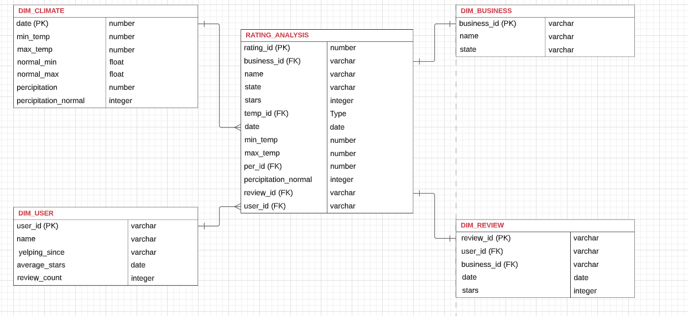

# Data Architect Nano Degree- Project 3

## 1. Background & Objective of the Project

The objective of this project is to use actual YELP and climate datasets in order to analyze the effects the weather has on customer reviews of restaurants. The data for temperature and precipitation observations are from the Global Historical Climatology Network-Daily (GHCN-D) database. A leading industry cloud-native data warehouse system Snowflake will be used for all aspects of the project to demonstrate  the ability to design data systems and  design a Data Warehouse DWH for the purpose of reporting and online analytical processing (OLAP).

## 2. Data Architecture Diagram

The data architecture diagram can be explained as follows - 

Data Sources: 

1.	8 data files are downloaded in the local disc, these are-

a.	JSON files: the JSON files are Yelp data

    • Business
    • Check-in
    • Covid
    • Review
    • Tip
    • Users

b.	2 CSV files: contains weather data

    • Temperature
    • Precipitation

Picture below shows the staging schema tables: 

2.	All the files have been uploaded to the staging schema.

3.	From staging schema, the data is copied and converted to appropriate data format and placed into staging schema tables.

4.	From staging schema the data is inserted to DWH table for the analytical processing environment. 

## 3. Staging Data

A. **Climate Data**: Two climates data files with file size smaller than 50 MB have been uploaded into Snowflake using browser. 

B. **Yelp Data**: Yelp data contains information related to Business, Review, Tip, Customer, Checkin and Covid tables have been created by loading local data files into a Snowflake staging schema, using the command-line snowsql tool. 

## 4. Transform Data From Staging to ODS

SQL code has been used to convert the staging schema tables into ODS tables. 

Appropriate data type conversion has been made as necessary. 

The ERD shows the relationship between the entities of the ODS.  

Table below shows the data size in raw, staging and ODS. This clearly indicates, data has been compressed in staging and ODS. 

## 5. DWH Schema 

A STAR schema has been made for OLAP processing. 

## 6. File Descriptions

1. `YELP_DATA_UPLOAD_USING_CLI`: contains the Power Shell command lines to uplaod the large data files. 

2. `ODS_tables.sql`: contains the sql code requires to create tables in the ODS schema, and insert data from staging.

3. `DWH_tables.sql`: contains the sql code requires to create tables in the DWH STAR schema, and insert data from ODS.

4. `Design a Data Warehouse in Snowflake for Reporting and OLAP.pdf`: contains the project writing. 

