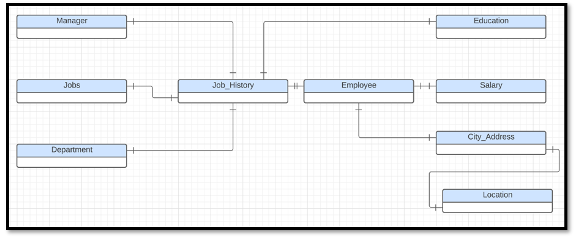
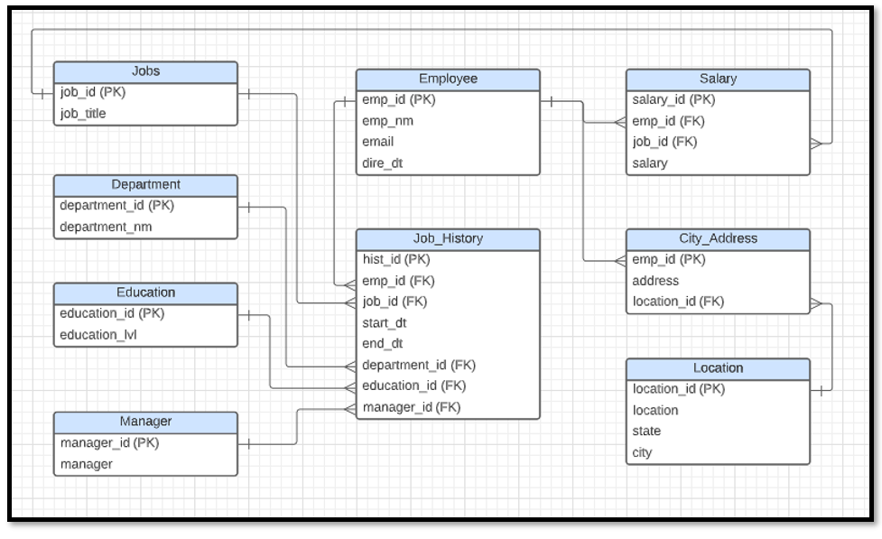
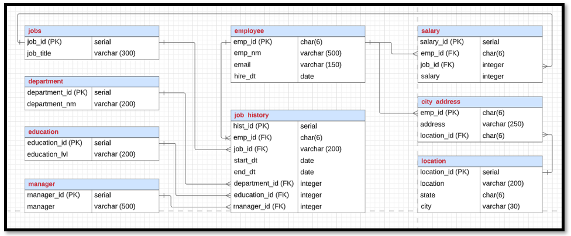

# Data Architect Nano Degree- Project 1

## 1. Business requirement
Tech ABC Corp saw explosive growth with a sudden appearance onto the gaming scene with their new AI-powered video game console. As a result, they have gone from a small 10 person operation to 200 employees and 5 locations in under a year. HR is having trouble keeping up with the growth, since they are still maintaining employee information in a spreadsheet. While that worked for ten employees, it has becoming increasingly cumbersome to manage as the company expands.

As such, the HR department has requested the new data architect, to design and build a database capable of managing their employee information.

## 2. [Dataset](https://github.com/jahid-razan/Data-Architecutre-Nanodegree/blob/main/Designing%20an%20HR%20Database/hr-dataset.xlsx)
The HR dataset is currently in an Excel workbook which consists of 206 records, with eleven columns. The data is in human readable format, and has not been normalized at all. The data lists the names of employees at Tech ABC Corp as well as information such as job title, department, manager's name, hire date, start date, end date, work location, and salary.

## 3. [IT Department Best Practices](https://github.com/jahid-razan/Data-Architecutre-Nanodegree/blob/main/Designing%20an%20HR%20Database/IT%20Best%20Practices.pdf)
The IT Department has certain Best Practices policies for databases you should follow, as detailed in the Best Practices document.

## 4. Steps

1. As the first steps business requirements for a new database request have been gathered and a non-technical proposal document have been prepared. 
Then, the non-technical proposals have been converted into a technical proposal document. All these are listed in the [project ppt file](https://github.com/jahid-razan/Data-Architecutre-Nanodegree/blob/main/Designing%20an%20HR%20Database/Project_Summary.pptx). 

2. Conceptual, Logical and Physical ERD has been created for the data.

**Conceptual ERD**:  This is the most general level of data modeling. At the conceptual level, entities are created that represent business objects for the database. 
 

**Logical ERD**: The logical model is the next level of refinement from the conceptual ERD. At this point,the data is normalized to the 3NF. Attributes are listed in the ERD. 
Human-friendly entity and attribute names  are used in the logical model, and while high level relationship lines are required.

 

**Physical ERD**: The physical model is what will be built in the database. Each entity should represent a database table, complete with column names and data types. Primary keys and foreign keys are represented here. Primary keys are indicated using PK designation following the field name. Foreign keys have the designation (FK) after the column name. 
Finally, in the physical model, Crow's foot notations are indicated.

 

3. A physical database has been created for the normalized schema using the [DDL commands](https://github.com/jahid-razan/Data-Architecutre-Nanodegree/blob/main/Designing%20an%20HR%20Database/DDL_postgres.sql). 

4. Data has been populated in the database and [CRUD commands](https://github.com/jahid-razan/Data-Architecutre-Nanodegree/blob/main/Designing%20an%20HR%20Database/Questions_CRUD%20operations.sql) have been performed to demonstrate a working database.

## 5. CRUD operations

Following questions involving CRUD operations have been answered. 

* Question 1: Return a list of employees with Job Titles and Department Names
* Question 2: Insert Web Programmer as a new job title
* Question 3: Correct the job title from web programmer to web developer
* Question 4: Delete the job title Web Developer from the database
* Question 5: How many employees are in each department?
* Question 6: Write a query that returns current and past jobs (include employee name, job title, department, manager name, start and end date for position) for employee Toni Lembeck.
* Question 7: Describe how you would apply table security to restrict access to employee salaries using an SQL server.

**Additional Questions**: 

1. Create a view that returns all employee attributes; results should resemble initial Excel file.

2. Create a stored procedure with parameters that returns current and past jobs (include employee name, job title, department, manager name, start and end date for position) when given an employee name.

3.Create a non-management user named NoMgr. Show the code of how your would grant access to the database, but revoke access to the salary data.Submit screenshot of code

## 6. File Descriptions

1. `hr-dataset.xlsx`: Contains the original dataset obtained from HR. 

2. `IT Best Practices.pdf` : Contains the IT best practices guideline. 

3. `Insert_data.sql` : Contains the command can be used to insert data into the database. 

4. `DDL_postgres.sql`: Contains the DDL commands used to create the database. 

5. `Questions_CRUD operations.sql`: Contains the sql commands for the questions listed in section 4 and 5. 

5. `Project_Summary.pptx`: Contains the project writing. 

